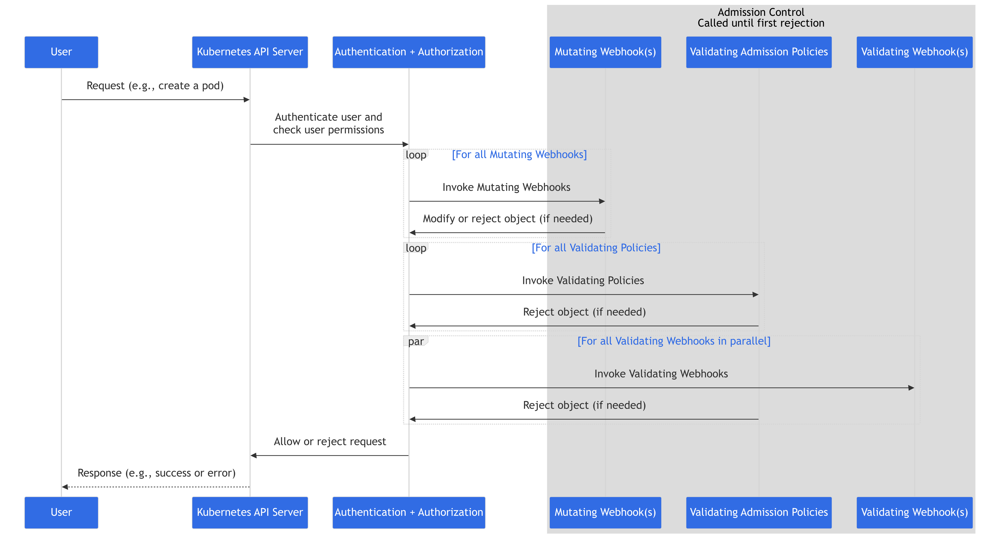

[](https://goreportcard.com/report/github.com/lukaross368/admissions-webhook) 

# Admissions Webhook

## Overview

### Motivation
The main motivations for this project were to gain practical experience; writing go code, writing helm charts and writing code that extends out of the box kubernetes functionality.

### Repository Contents
This repository contains:
- Go-based Kubernetes admission webhook server which provides some very basic logic for validating and mutating pods.
- Unit tests that provide coverage of the validation and mutation logic.
- Helm chart for deploying the webhook to a cluster with Kubernetes webhook configurations and monitoring dashboard.
- Some trivial pod manifests that can be used to verify the mutation and validation logic.

### Webhook Server Features

- Processes Kubernetes `AdmissionReview` requests by exposing `/mutate-pods` and `/validate-pods` https webhook endpoints
- Performs validation. Webhook will pass validation if each container in the pod contains a liveness and readiness probe.
- Performs mutations. If the pod has `restartPolicy == "Never"` this is mutated to be `restartPolicy == "Always"`. 
- Logs and returns structured responses back to the API server (Inspiration taken from a webhook server under the /tests directory of the [kubernetes source code](https://github.com/kubernetes/kubernetes/blob/release-1.21/test/images/agnhost/webhook)).
- Exposes count and latency Prometheus metrics for each webhook via a std metrics endpoint accepting traffic on port 2112

See these files for the exact mutation and validation logic [mutate.go](https://github.com/lukaross368/admissions-webhook/blob/main/pkg/webhooks/mutate.go), [validate.go](https://github.com/lukaross368/admissions-webhook/blob/main/pkg/webhooks/validate.go)

---

## Context

### What Is an Admission Webhook?

Kubernetes uses [*admission controllers*](https://kubernetes.io/docs/reference/access-authn-authz/admission-controllers/) to intercept API requests before they are persisted in the cluster. These controllers can either **validate** (accept or reject) or **mutate** (modify) requests.  

The API component of this project acts as a dynamic extension of this system: A [dynamic admissions webhook](https://kubernetes.io/docs/reference/access-authn-authz/extensible-admission-controllers/) runs as a separate service and is hooked into Kubernetes to enforce custom logic.

  
*Figure: API request flow through Kubernetes admission controllers (source: [Kubernetes Docs](https://kubernetes.io/docs/reference/access-authn-authz/admission-controllers/))*


---

## Setup

### Building and Testing Locally
You can build and run the webhook locally, either as a raw binary or inside a container.

**Build + Generate Certs + Run the binary:**
```bash
make run
```

**Run Webhook logic unit tests**
```
make test
```

**Test via cURL on localhost**
```
# example of request that we would expect to fail validation
curl --cacert ./certs/tls.crt.pem \
  -X POST https://localhost:8443/validate-pods \
  -H "Content-Type: application/json" \
  -d '{
    "apiVersion": "admission.k8s.io/v1",
    "kind": "AdmissionReview",
    "request": {
      "uid": "87654321-4321-4321-4321-0987654321ab",
      "kind": {
        "group": "",
        "version": "v1",
        "kind": "Pod"
      },
      "resource": {
        "group": "",
        "version": "v1",
        "resource": "pods"
      },
      "namespace": "default",
      "operation": "CREATE",
      "object": {
        "apiVersion": "v1",
        "kind": "Pod",
        "metadata": {
          "name": "invalid-pod",
          "namespace": "default",
          "labels": {
            "app": "demo-fail"
          }
        },
        "spec": {
          "containers": [
            {
              "name": "app-container",
              "image": "nginx:latest",
              "ports": [
                {
                  "containerPort": 80
                }
              ]
            }
          ],
          "restartPolicy": "Never"
        }
      },
      "userInfo": {
        "username": "test-user",
        "uid": "test-uid",
        "groups": ["system:authenticated"]
      }
    }
  }'

```
And we should see the response 

```
{
    "kind": "AdmissionReview",
    "apiVersion": "admission.k8s.io/v1",
    "response": {
        "uid": "87654321-4321-4321-4321-0987654321ab",
        "allowed": false,
        "status": {
            "metadata": {},
            "message": "container app-container failed validation due to missing Liveness Probe, container app-container failed validation due to missing Readiness Probe",
            "code": 403
        }
    }
}
```

### Building with Docker
You can also build and run the webhook locally inside a Docker container.

**Build the Docker image:**
```bash
docker build -t admissions-webhook:latest .
```

**Create certs**
```bash
make certs
```

**Run the container:**
```bash
docker run -p 8443:8443 \
  -v $(pwd)/certs:/certs \
  admissions-webhook:latest \
  --tls-cert-file=/certs/tls.crt.pem \
  --tls-private-key-file=/certs/tls.key.pem \
  --port=8443

```

**Test via cURL on localhost**

```
# example of a request that will trigger the mutation
curl --cacert ./certs/tls.crt.pem \
  -X POST https://localhost:8443/mutate-pods \
  -H "Content-Type: application/json" \
  -d '{
    "apiVersion": "admission.k8s.io/v1",
    "kind": "AdmissionReview",
    "request": {
      "uid": "12345678-1234-1234-1234-1234567890ab",
      "kind": {
        "group": "",
        "version": "v1",
        "kind": "Pod"
      },
      "resource": {
        "group": "",
        "version": "v1",
        "resource": "pods"
      },
      "namespace": "default",
      "operation": "CREATE",
      "object": {
        "apiVersion": "v1",
        "kind": "Pod",
        "metadata": {
          "name": "mutate-pod",
          "namespace": "default",
          "labels": {
            "environment": "prod"
          }
        },
        "spec": {
          "containers": [
            {
              "name": "app-container",
              "image": "nginx:latest",
              "ports": [
                {
                  "containerPort": 80
                }
              ]
            }
          ],
          "restartPolicy": "Never"
        }
      },
      "userInfo": {
        "username": "test-user",
        "uid": "test-uid",
        "groups": ["system:authenticated"]
      }
    }
  }'
```

**Expected Response (mutation applied):**

```
{
    "kind": "AdmissionReview",
    "apiVersion": "admission.k8s.io/v1",
    "response": {
        "uid": "12345678-1234-1234-1234-1234567890ab",
        "allowed": true,
        "patch": "WwoJCSB7Im9wIjogInJlcGxhY2UiLCAicGF0aCI6ICIvc3BlYy9yZXN0YXJ0UG9saWN5IiwgInZhbHVlIjogIkFsd2F5cyJ9Cgld",
        "patchType": "JSONPatch"
    }
}
```
**Decode the patch**

```
echo WwoJCSB7Im9wIjogInJlcGxhY2UiLCAicGF0aCI6ICIvc3BlYy9yZXN0YXJ0UG9saWN5IiwgInZhbHVlIjogIkFsd2F5cyJ9Cgld | base64 -d 
```
**Which gives**
```
[
    {
        "op": "replace",
        "path": "/spec/restartPolicy",
        "value": "Always"
    }
]
```


### Installing With Helm

For instructions on how to deploy the webhook server in a cluster see the [Helm Chart Installation Instructions](/charts/adminssions-webhook/README.md)

---

## What I learned / Improvements

### What I Learned
- The lifecycle of an admission request
- How to build a secure webhook server with TLS
- How Kubernetes validates and mutates resources
- Packaging and deploying workloads with Helm

### What I kept simple / could be improved 
- Certificate setup should be dynamic and/or used central CA signed instead of self signed.
- Minimal validation and mutation logic
- Improved logging
- Error handling paths that could be more robust
- Full test coverage
- Full Helm chart test coverage

---
